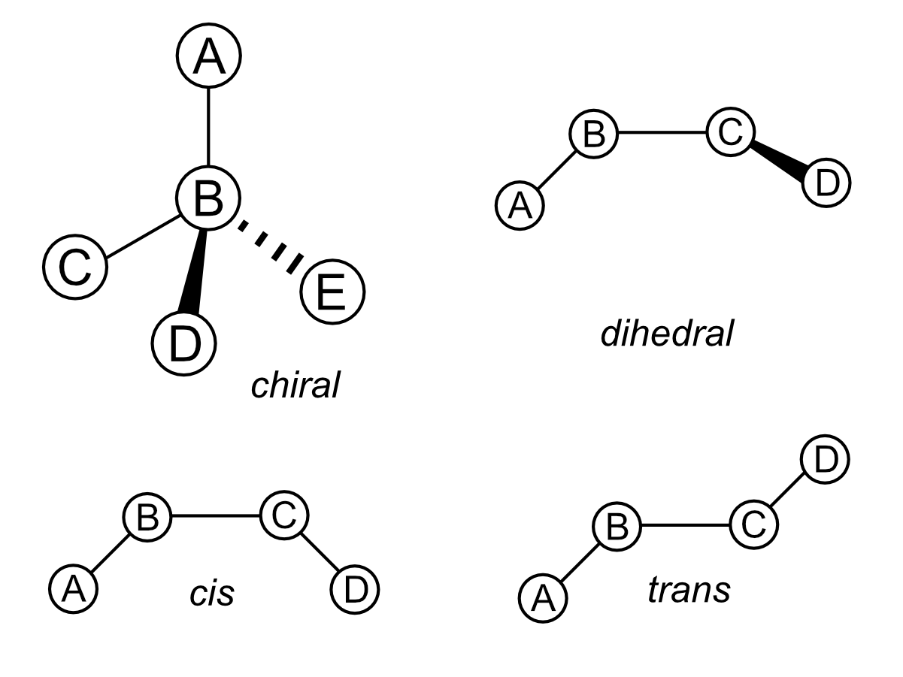

Input
=====

Structure
---------
mstool can read and write **PDB** or **DMS** files. **GRO** files are not supported because they do not contain chain information. Note that each residue in a structure file should have a unique set of (resname, resid, chain) to use mstool. **In other words, no more than one residue should have the same resname, resid, and chain name.** Large systems can bump into this issue because PDB only supports a residue number from 0 to 9999 because of a limit of PDB formatting on the length of resid. For instance, water molecules can easily hit this limit if they all have the same chain name. To avoid this problem, reassign the chain names of water for every 10,000 water molecules or use DMS files that do not limit the length of chain, resid, or resname.

Mapping
-------
Files containing **mapping** and **isomeric** information, referred to as simply *mapping files* throughout the documentation, are central and required input files in mstool. They describe which atoms belong to which coarse-grained beads and isomeric information (**cis/trans/chiral/dihedral**) if molecules are isomers. If no user mapping files are provided, mstool will read the predefined mapping files for Martini force fields, ``$mstoolpath/mapping/martini.protein.c36m.dat`` and ``$mstoolpath/mapping/martini.lipid.c36.dat``.

For each residue type, write a residue name, following a keyword, RESI. Put the name of a coarse-grained bead in a square bracket and an atom name that belongs to the coarse-grained bead in the following line. For instance, consider a methane molecule, CH4. Suppose a coarse-grained force field has one bead per each methane molecule whose coarse-grained bead name is CG1. A methane mapping file (residue name METH) will look something like:

.. code-block:: text

   RESI METH
   [ CG1 ]
   C1 H1 H2 H3 H4

If a molecule has a chiral center, and you want backmapped molecules that are enantiomerically pure rather than racemic, specify five atoms using their atomic names to describe each chiral center.

.. code-block:: text

   [ chiral ]
   A B C D E

In the above example, Atom B is the central atom of a tetrahedron. Curl your right fingers in the order of C -> D -> E. Your right thumb should point in the direction of Atom A, perpendicular to the C-D-E triangle. 

Users can also set a dihedral angle. A dihedral of A, B, C, and D atoms will be 90 degrees in a backmapped structure with the below input.

.. code-block:: text

   [ dihedral ]
   A B C D 90.0

Geometric isomerism can be defined using *dihedral*. For instance, the below two represent a *cis* arrangement of four atoms and are equivalent. 

.. code-block:: text

   [ cis ]
   A B C D

.. code-block:: text

   [ dihedral ]
   A B C D 0.0

Similarly, the below two define a *trans* arrangement of four atoms and are equivalent.

.. code-block:: text

   [ trans ]
   A B C D

.. code-block:: text

   [ dihedral ]
   A B C D 180.0

Atomic arrangements of the supported isomeric properties in a mapping file are shown in :ref:`Figure 1 <isomer>`.

.. _isomer:

    
   Figure 1. Atomic arrangements of chiral, dihedral, cis, and trans.

Force field
-----------
All-atom, openMM-formatted (**XML**) force fields should be provided to use mstool. If no user force fields are provided, mstool will read the default charmm36 force fields, ``$mstoolpath/FF/charmm36/charmm36.xml`` and ``$mstoolpath/FF/charmm36/water.xml``.

.. note::

   Residue names, coarse-grained bead names, and atomic names should be consistent between these input files, structures, mapping files, and force fields.

